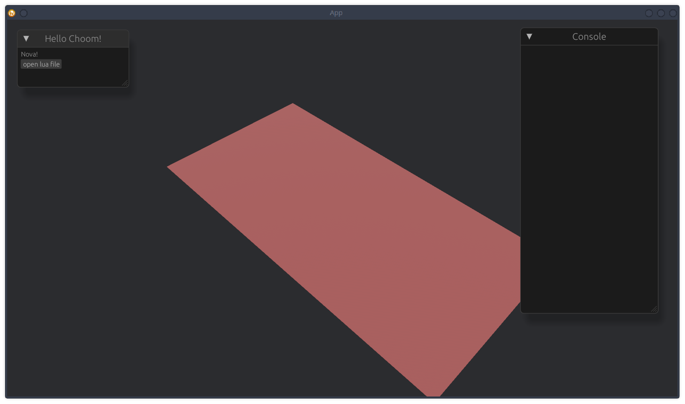
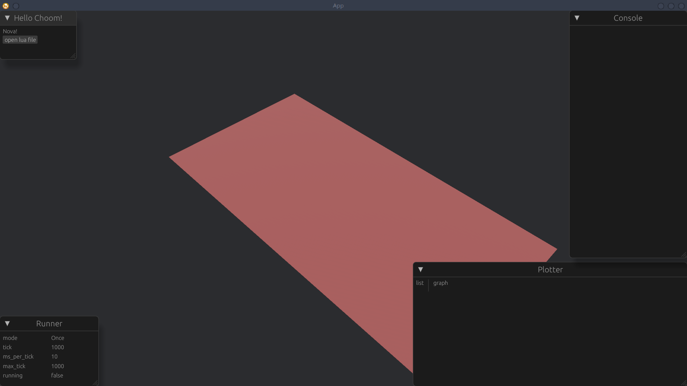
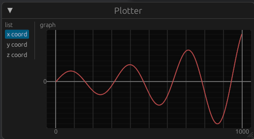
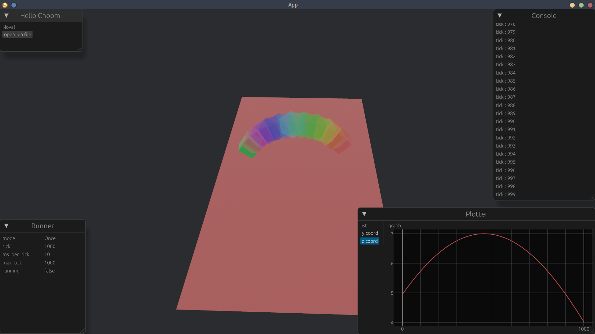

# Sandy Tour Guide

## Installation
Follow the installation guide in the [repo README](../README.md)

## Introduction
Sandy is a visualization engine,
it reqire a `.lua` project file to run,
and the lua script can interact with the functionality of the engine

## Start Application


### Camera Navigation
You can use keyboard or a game controller to control the camera

On keyboard:
- `w,a,s,d`: for cardinal direction
- `e,q`: for forward and backward
- `r`: for switching camera mode, i.e. 2D and 3D

On Game Controller:
- `L joy stick`: for cardinala direction
- `L2,R2`: for forward and backward
- `L3`: for switch camera mode.

#### Camera Mode
There are two mode of camera:
- *2D*: It always face downward, and move along x,y,z coordinate
- *3D*: It always face toward origin, and orbit around origin.

#### lua api
you can control the camera with lua api:
```lua
Camera.plane({ x=0, y=0, z=50 })  -- 2D mode with xyz coordinate
Camera.space({ r=5, rx=45, rz=0}) -- 3D mode with orbit coordinate
```

### Windows
There are different windows inside the application.

- `esc` to toggle the Hello windows
- `ctrl-r` to toggle the runner window
- `ctrl-p` to toggle the plot window
- `ctrl-c` to toggle the console window

all windows are movable and resizable.



#### Hello Window
The hello window, have only one button, `open lua file`.

when clicked a file picker window will show, 
in which you can pick a project file to load.

> once loaded, sandy will monitor the whole directory,
>
> if there are any change, sandy will hot reload the project.

#### Console Window
The console window is for debugging projects,

to utilize the console window, in lua, use 
```lua
Console.print(str);
Console.clear()
```

#### Runner Window
The runner window show the project runner.

sandy project run on tick, in this window, 
you can inspect the runner configuration:
- `mode`: either "Once" or "Repeat"
- `tick`: what is the current tick
- `ms_per_tick`: how long a tick should take
- `max_tick`: how much tick to run, when reach, either halt or restart, depend on `mode`
- `running`: is the runner currently running

> you can use `space` key to toggle `running`.

#### Plot Window
The plot window is a buildin plotting tools.

You can use it to plot time-series data in lua by:
```lua
Plotter.push("name of a plot", 420);
```
this will push a data point to the plot.

## Setup Project
In the Repo [release page](https://github.com/dizzyi/sandy/releases),
download the project template.

The project template contains:
- `.luarc.json`: which configure lua language server, allow for type hints,
- `/meta`: a directory that contains definition of sandy api, *don't import this file*
- `util.lua`: a lua module with helper functions
- some project examples

## 0. Hello Choom
load `0.hello choom.lua`, you should see a red ball spawned,

uncomment the line:
```lua
    z = tick * 0.01
```
and immediately, you should see the red ball raising.

## 1. Sandy Project
load `1.sandy project.lua`

Sandy is defined by a lua module,

the lua module is expected to return a table with field:
- `runner`: which define the runner of the project
- `chromes`: which define a list object that create, render and controller
- `on_startup`: which define a function that will be run when a project is start/restarted
- `on_tick`: which define a function that will run every tick

## 2. Chrome
load `2.chrome.lua`
The main object that will be created, render, and control throught lua script

it consist of field:
- `parts`: that the object that the will be rendered,
- `on_tick`: define a function return a transform of which the chrome will be rendered.

## 3. Plot and Camera
load `3.plot and camera.lua`

This demo show how to interact with the camera and plotter api.




## 4. Transform
load `4.transform.lua` and `4.transform2.lua`

You can create more complicated transform from roation and multiplying
different transform.




